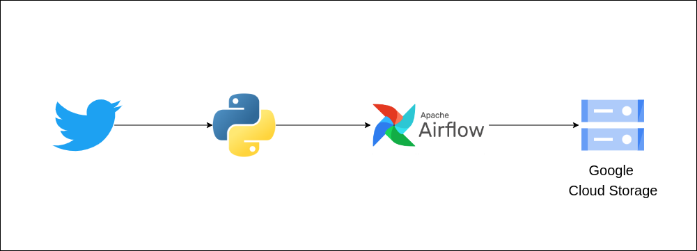

# Pipeline for Tweets ETL
Takes tweets from specified account and saves them to csv file

## Pipeline Flowchart


## Steps
1 - Create function to do the transformations and export  
1.1 - Import Packages and Modules
```python
import google.auth
from google.cloud import storage

import variables as v
import pandas as pd
import tweepy
```
1.2 - Make Google and Twitter authentication
```python
# Google auth
    credentials, project = google.auth.default()
    client = storage.Client(credentials=credentials)

    # Twitter auth
    auth = tweepy.OAuthHandler(v.access_key, v.access_secret)
    auth.set_access_token(v.consumer_key, v.consumer_secret)

    # Creating API object
    api = tweepy.API(auth)
```
1.3 - Extract tweets from desired account from JSON format and append to list
```python
tweets = api.user_timeline(screen_name='@elonmusk',
                               count=200,
                               include_rts=False,
                               tweet_mode='extended')

tweet_list = []
for tweet in tweets:
    text = tweet._json["full_text"]

    refined_tweet = {"user": tweet.user.screen_name,
                        "text": text,
                        "favorite_count": tweet.favorite_count,
                        "retweet_count": tweet.retweet_count,
                        "created_at": tweet.created_at}

    tweet_list.append(refined_tweet)   
```
1.4 - Create Pandas DataFrame with values
```python
dataframe = pd.DataFrame(tweet_list) 
```
1.5 - Write CSV file to Google Cloud Storage bucket
```python
bucket = client.get_bucket(v.bucket_name)
bucket.blob('data/twitter_data.csv') \
        .upload_from_string(dataframe.to_csv(), 'text/csv')
```
  
2 - Write Airflow DAG
2.1 - Import Packages and Modules
```python
from datetime import timedelta
from airflow import DAG
from airflow.operators.python import PythonOperator
from airflow.utils.dates import days_ago
from tweepy_etl import run_twitter_etl
```
2.2 - Set default_args for DAG
```python
default_args = {
    'owner': 'airflow',
    'depends_on_past': False,
    'start_date': days_ago(1),
    'email': ['tweepy@etlproject.com'],
    'email_on_failure': False,
    'email_on_retry': False,
    'retries': 1,
    'retry_delay': timedelta(minutes=1)
}
```
2.3 - Create dag object
```python
dag = DAG(
    "tweepy_dag",
    default_args=default_args,
    description='ETL with Twitter data'
)
```
2.4 - Create ETL task
```python
run_etl = PythonOperator(
    task_id="twitter_data_etl",
    python_callable=run_twitter_etl,
    dag=dag
)
```